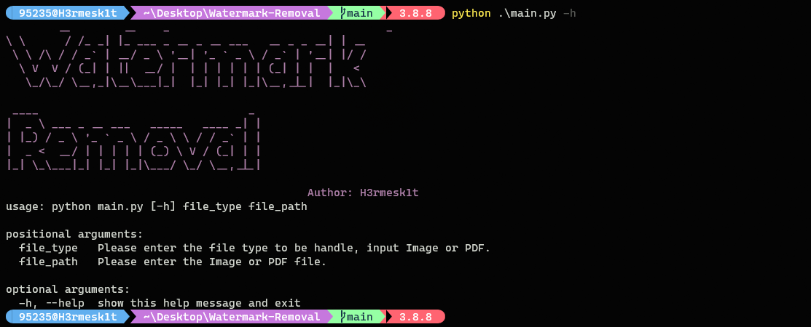

# Watermark-Removal

## Description

For some reason, temporarily write a python script for removing the watermark in the document, the specific features to be optimized. The final processing of the document will be lost in accuracy, so I don't want to change it for now, and will refactor it when I have a need for this script.

## Usage

- Command

```bash
usage: python main.py [-h] file_type file_path

positional arguments:
  file_type   Please enter the file type to be handle, input Image or PDF.
  file_path   Please enter the Image or PDF file.

optional arguments:
  -h, --help  show this help message and exit
```

- Program Interface



- Image watermark removal


- PDF watermark removal


